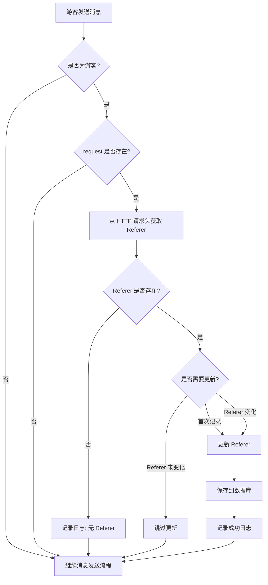

# Referer 追踪功能实现文档

## 📋 功能概述

在 `MobileServiceService.sendMessage()` 方法中添加了从 HTTP 请求头获取 Referer 的功能，用于追踪游客的访问来源。

---

## 🎯 实现目标

1. **自动获取 Referer**：当游客发送消息时，自动从 HTTP 请求头中获取 `Referer` 字段
2. **智能更新策略**：只在以下情况更新 Referer：
   - 首次发送消息（Referer 为空）
   - Referer 发生变化
3. **不影响主流程**：Referer 获取失败不影响消息发送功能
4. **仅针对游客**：只对游客（`is_tourist = 1`）进行 Referer 追踪

---

## 🔧 技术实现

### 1. 数据库变更

#### 新增字段

在 `eb_chat_user` 表中添加了两个字段：

| 字段名 | 类型 | 默认值 | 说明 |
|--------|------|--------|------|
| `referer` | VARCHAR(500) | '' | 来源页面（HTTP Referer） |
| `referer_updated_time` | INT | 0 | Referer 更新时间（Unix时间戳） |

#### 索引优化

```sql
-- 为 referer 字段添加索引（方便按来源查询）
ALTER TABLE `eb_chat_user` ADD INDEX `idx_referer` (`referer`(255));

-- 为 referer_updated_time 字段添加索引（方便按更新时间查询）
ALTER TABLE `eb_chat_user` ADD INDEX `idx_referer_updated_time` (`referer_updated_time`);
```

#### 执行迁移

```bash
# 进入数据库
mysql -u root -p crmchat

# 执行迁移脚本
source backend/security-enterprise-tenant/crmchat/db/migrations/add_referer_to_chat_user.sql
```

---

### 2. 实体类变更

#### ChatUserEntity.java

添加了两个新属性：

```java
/**
 * 来源页面（HTTP Referer）
 */
@TableField("referer")
private String referer;

/**
 * Referer 更新时间（Unix时间戳）
 */
@TableField("referer_updated_time")
private Integer refererUpdatedTime;
```

---

### 3. Service 层实现

#### MobileServiceService.sendMessage()

在 `sendMessage()` 方法中添加了 Referer 获取逻辑（第 1252-1301 行）：

```java
// ✅ 新增：获取并更新 Referer 信息
// 获取条件：
// 1. 是游客（is_tourist = 1）
// 2. Referer 为空 OR Referer 发生变化
if (chatUser.getIsTourist() != null && chatUser.getIsTourist() == 1 && request != null) {
    try {
        // 从 HTTP 请求头中获取 Referer
        String currentReferer = request.getHeader("Referer");
        if (currentReferer == null || currentReferer.trim().isEmpty()) {
            currentReferer = request.getHeader("referer"); // 尝试小写
        }
        
        // 如果 Referer 存在且有效
        if (currentReferer != null && !currentReferer.trim().isEmpty()) {
            currentReferer = currentReferer.trim();
            String lastReferer = chatUser.getReferer();

            // 判断是否需要更新 Referer
            boolean needUpdateReferer = false;
            String refererUpdateReason = "";

            if (lastReferer == null || lastReferer.isEmpty()) {
                // 首次发送消息，没有 Referer 记录
                needUpdateReferer = true;
                refererUpdateReason = "首次记录 Referer";
            } else if (!currentReferer.equals(lastReferer)) {
                // Referer 发生变化
                needUpdateReferer = true;
                refererUpdateReason = "Referer 变化: " + lastReferer + " -> " + currentReferer;
            }

            if (needUpdateReferer) {
                log.info("🔗 [REFERER] Visitor referer changed, updating: userId={}, reason={}", 
                         userId, refererUpdateReason);

                // 更新用户 Referer 信息
                chatUser.setReferer(currentReferer);
                chatUser.setRefererUpdatedTime((int) (System.currentTimeMillis() / 1000));
                chatUserMapper.updateById(chatUser);

                log.info("✅ [REFERER] Successfully updated referer: userId={}, referer={}", 
                         userId, currentReferer);
            } else {
                log.debug("ℹ️ [REFERER] Visitor referer unchanged, skipping update: userId={}, referer={}", 
                          userId, currentReferer);
            }
        } else {
            log.debug("ℹ️ [REFERER] No referer in request headers: userId={}", userId);
        }
    } catch (Exception e) {
        // Referer 获取失败不影响主流程
        log.error("❌ [REFERER] Error updating referer: userId={}, error={}", 
                  userId, e.getMessage(), e);
    }
}
```

---

## 📊 工作流程



---

## 🔍 日志示例

### 成功更新 Referer

```log
2025-10-31 10:30:15 INFO  [REFERER] Visitor referer changed, updating: userId=12345, reason=首次记录 Referer
2025-10-31 10:30:15 INFO  [REFERER] Successfully updated referer: userId=12345, referer=https://example.com/landing-page
```

### Referer 未变化

```log
2025-10-31 10:35:20 DEBUG [REFERER] Visitor referer unchanged, skipping update: userId=12345, referer=https://example.com/landing-page
```

### 无 Referer

```log
2025-10-31 10:40:25 DEBUG [REFERER] No referer in request headers: userId=12345
```

### 更新失败（不影响主流程）

```log
2025-10-31 10:45:30 ERROR [REFERER] Error updating referer: userId=12345, error=Database connection timeout
```

---

## 📈 应用场景

### 1. 营销分析

- 追踪游客来源渠道（搜索引擎、社交媒体、广告链接等）
- 分析哪些页面带来的转化率最高
- 优化营销投放策略

### 2. 用户行为分析

- 了解用户访问路径
- 分析用户从哪些页面进入客服系统
- 优化网站导航和用户体验

### 3. 客服优化

- 客服可以看到用户从哪个页面进入
- 提供更有针对性的服务
- 快速定位用户问题

---

## 🔒 安全性考虑

1. **字段长度限制**：Referer 字段限制为 500 字符，防止恶意超长 URL
2. **异常处理**：所有异常都被捕获，不影响主流程
3. **仅游客追踪**：只对游客进行追踪，保护注册用户隐私
4. **数据清洗**：对 Referer 进行 trim() 处理，去除首尾空格

---

## 🧪 测试建议

### 1. 单元测试

```java
@Test
public void testSendMessageWithReferer() {
    // 模拟 HTTP 请求
    MockHttpServletRequest request = new MockHttpServletRequest();
    request.addHeader("Referer", "https://example.com/landing-page");
    
    // 准备测试数据
    Map<String, Object> data = new HashMap<>();
    data.put("guid", "test-guid-123");
    data.put("user_id", 12345);
    data.put("to_user_id", 67890);
    data.put("msn", "Hello");
    
    // 调用方法
    Map<String, Object> result = mobileServiceService.sendMessage(data, "test-appid", request);
    
    // 验证结果
    assertNotNull(result);
    
    // 验证数据库中的 Referer 已更新
    ChatUserEntity user = chatUserMapper.selectById(12345);
    assertEquals("https://example.com/landing-page", user.getReferer());
    assertTrue(user.getRefererUpdatedTime() > 0);
}
```

### 2. 集成测试

使用 Postman 或 curl 测试：

```bash
curl -X POST http://localhost:8080/api/mobile/service/send_message \
  -H "Content-Type: application/json" \
  -H "Referer: https://example.com/landing-page" \
  -H "Authorization: Bearer YOUR_TOKEN" \
  -d '{
    "guid": "test-guid-123",
    "user_id": 12345,
    "to_user_id": 67890,
    "msn": "Hello",
    "msn_type": 1
  }'
```

---

## 📝 后续优化建议

1. **Referer 解析**：解析 Referer URL，提取域名、路径、参数等信息
2. **来源分类**：自动识别来源类型（搜索引擎、社交媒体、直接访问等）
3. **统计报表**：在管理后台添加来源统计报表
4. **UTM 参数支持**：支持解析 UTM 参数（utm_source, utm_medium, utm_campaign 等）
5. **数据清理**：定期清理过期的 Referer 数据

---

## 📚 相关文件

- **实体类**：`backend/security-enterprise-tenant/crmchat/src/main/java/io/renren/crmchat/entity/ChatUserEntity.java`
- **Service 层**：`backend/security-enterprise-tenant/crmchat/src/main/java/io/renren/crmchat/service/MobileServiceService.java`
- **数据库迁移**：`backend/security-enterprise-tenant/crmchat/db/migrations/add_referer_to_chat_user.sql`

---

## ✅ 完成清单

- [x] 数据库表添加 `referer` 和 `referer_updated_time` 字段
- [x] 实体类添加对应属性
- [x] Service 层实现 Referer 获取逻辑
- [x] 添加详细日志记录
- [x] 异常处理确保不影响主流程
- [x] 创建数据库迁移脚本
- [x] 编写实现文档

---

**文档版本**：v1.0  
**最后更新**：2025-10-31  
**作者**：CRMChat Team

