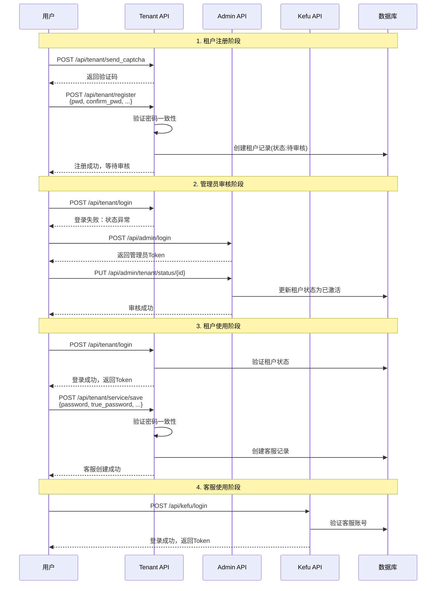
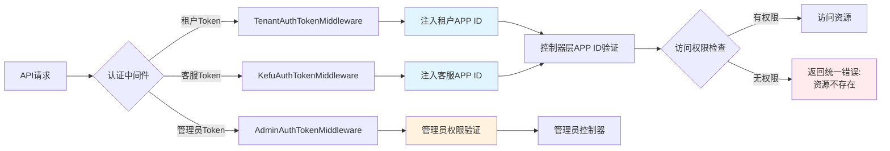

# CRMChat API Schema Documentation

## 目录
- [系统流程图](#系统流程图)
- [认证说明](#认证说明)
- [默认账户信息](#默认账户信息)
- [Admin API](#admin-api)
- [Tenant API](#tenant-api)
- [Kefu API](#kefu-api)
- [Mobile API](#mobile-api)
- [安全特性](#安全特性)

## 系统流程图

### 租户完整生命周期流程

```mermaid
flowchart TD
    A[开始] --> B[发送注册验证码]
    B --> |POST /api/tenant/send_captcha| C[接收验证码]
    C --> D[租户注册]
    D --> |POST /api/tenant/register<br/>包含 pwd + confirm_pwd| E{注册验证}
    E --> |密码不一致| F[返回400错误:<br/>两次输入的密码不一致]
    E --> |验证成功| G[租户创建成功<br/>状态: 待审核]
    
    G --> H[尝试登录]
    H --> |POST /api/tenant/login| I{租户状态检查}
    I --> |待审核状态| J[登录失败:<br/>租户状态异常：待审核]
    
    I --> K[管理员审核]
    K --> |PUT /api/admin/tenant/status/{id}<br/>{"status": 1}| L[租户状态更新为已激活]
    
    L --> M[租户重新登录]
    M --> |POST /api/tenant/login| N[登录成功<br/>获取Token]
    
    N --> O[创建客服账号]
    O --> |POST /api/tenant/service/save<br/>包含 password + true_password| P{客服创建验证}
    P --> |密码不一致| Q[返回400错误:<br/>两次密码输入不一致]
    P --> |验证成功| R[客服账号创建成功<br/>默认状态: 禁用]
    
    R --> S[启用客服账号]
    S --> |PUT /api/tenant/service/update_status/{id}<br/>{"status": 1}| T[客服账号已启用]
    
    T --> U[客服登录]
    U --> |POST /api/kefu/login| V[客服登录成功<br/>获取Token]
    
    V --> W[开始使用系统]
    
    style G fill:#e1f5fe
    style N fill:#e8f5e8
    style V fill:#e8f5e8
    style W fill:#f3e5f5
    style F fill:#ffebee
    style J fill:#ffebee
    style Q fill:#ffebee
```

### 主要API调用序列



### API安全隔离机制



## 认证说明

### ⚠️ 重要提示
本项目使用**非标准的HTTP认证头**：`Authori-zation`（注意中间的连字符）

```bash
# ✅ 正确
curl -H "Authori-zation: Bearer <token>" http://localhost:20108/api/xxx

# ❌ 错误 
curl -H "Authorization: Bearer <token>" http://localhost:20108/api/xxx
```

### 基础URL
```
http://localhost:20108
```

## 默认账户信息

| 用户类型 | 用户名 | 密码 | 说明 |
|---------|--------|------|------|
| Admin | admin | 123456 | 平台管理员 |
| Tenant | tenant002 | 123456 | 测试租户 |
| Kefu | - | - | 由租户创建 |
| Mobile | - | - | 手机号登录 |

---

## Admin API

### 1. 管理员登录
**Endpoint:** `POST /api/admin/login`

**Request:**
```json
{
  "account": "admin",
  "pwd": "123456"
}
```

**Response:**
```json
{
  "status": 200,
  "msg": "ok",
  "data": {
    "token": "eyJ0eXAiOiJKV1QiLCJhbGciOiJIUzI1NiJ9...",
    "expires_time": 1760497298,
    "menus": [...],
    "unique_auth": [...],
    "user_info": {
      "id": 1,
      "account": "admin",
      "head_pic": ""
    },
    "logo": "",
    "logo_square": "",
    "version": "CRMChat 1.2.0",
    "newOrderAudioLink": ""
  }
}
```

### 2. 获取租户列表
**Endpoint:** `GET /api/admin/tenant/list`

**Headers:**
```
Authori-zation: Bearer <admin_token>
```

**Request:**
```bash
curl -H "Authori-zation: Bearer <token>" \
     http://localhost:20108/api/admin/tenant/list
```

**Response:**
```json
{
  "status": 200,
  "msg": "ok", 
  "data": {
    "list": [
      {
        "id": 2,
        "appid": "tenant002",
        "tenant_name": "测试租户002",
        "tenant_code": "test002",
        "account": "tenant002",
        "contact_name": "王五",
        "contact_phone": "13700137000",
        "status": 1,
        "max_users": 1000,
        "max_services": 10,
        "expire_at": "",
        "created_at": "2025-09-14 08:30:31",
        "updated_at": "2025-09-15 09:53:44",
        "is_expired": false,
        "remaining_days": -1
      }
    ],
    "count": 2
  }
}
```

### 3. 创建租户
**Endpoint:** `POST /api/admin/tenant/save`

**Headers:**
```
Authori-zation: Bearer <admin_token>
Content-Type: application/json
```

**Request:**
```json
{
  "tenant_name": "新租户",
  "tenant_code": "new_tenant",
  "account": "tenant_new",
  "pwd": "123456",
  "contact_name": "张三",
  "contact_phone": "13800138000",
  "contact_email": "zhangsan@example.com",
  "max_users": 500,
  "max_services": 5,
  "expire_at": "2026-12-31",
  "status": 1
}
```

**Response:**
```json
{
  "status": 200,
  "msg": "创建成功",
  "data": {
    "id": 4
  }
}
```

### 4. 更新租户信息
**Endpoint:** `PUT /api/admin/tenant/update/:id`

**Headers:**
```
Authori-zation: Bearer <admin_token>
Content-Type: application/json
```

**Request:**
```json
{
  "tenant_name": "更新后的租户名称",
  "max_services": 20,
  "expire_at": "2027-12-31"
}
```

**Response:**
```json
{
  "status": 200,
  "msg": "更新成功",
  "data": []
}
```

### 5. 重置租户密码
**Endpoint:** `PUT /api/admin/tenant/reset_password/:id`

**Request:**
```json
{
  "password": "newpassword123"
}
```

---

## Tenant API

### 1. 发送注册验证码
**Endpoint:** `POST /api/tenant/send_captcha`

**Request:**
```json
{
  "phone": "13800138000"
}
```

**Response:**
```json
{
  "status": 200,
  "msg": "验证码发送成功，开发环境验证码：123456",
  "data": []
}
```

**说明**: 开发环境直接返回验证码用于测试，生产环境通过短信发送

### 2. 租户注册
**Endpoint:** `POST /api/tenant/register`

**Request:**
```json
{
  "tenant_name": "测试企业",
  "contact_name": "张三",
  "contact_phone": "13800138000",
  "contact_email": "zhangsan@example.com",
  "pwd": "yourpassword",
  "confirm_pwd": "yourpassword",
  "captcha": "123456"
}
```

**Response:**
```json
{
  "status": 200,
  "msg": "注册成功，请等待管理员审核",
  "data": {
    "tenant_id": 5,
    "tenant_code": "tenant_20250915_8765",
    "status": "待审核"
  }
}
```

**说明**: 
- 注册成功后状态为"待审核"，需要管理员审核通过后才能使用
- 租户编码和APP ID自动生成
- 验证码有效期10分钟
- pwd和confirm_pwd必须一致，否则返回400错误"两次输入的密码不一致"

### 3. 租户登录
**Endpoint:** `POST /api/tenant/login`

**Request:**
```json
{
  "account": "tenant002",
  "pwd": "123456"
}
```

**Response:**
```json
{
  "status": 200,
  "msg": "ok",
  "data": {
    "token": "eyJ0eXAiOiJKV1QiLCJhbGciOiJIUzI1NiJ9...",
    "expires_time": 1760498108,
    "tenant_info": {
      "id": 2,
      "appid": "tenant002",
      "tenant_name": "测试租户002",
      "tenant_code": "test002",
      "account": "tenant002",
      "status": 1,
      "max_users": 1000,
      "max_services": 10,
      "expire_at": "",
      "is_expired": false,
      "remaining_days": -1
    }
  }
}
```

### 2. 获取租户信息
**Endpoint:** `GET /api/tenant/info`

**Headers:**
```
Authori-zation: Bearer <tenant_token>
```

**Response:**
```json
{
  "status": 200,
  "msg": "ok",
  "data": {
    "tenant_info": {
      "id": 2,
      "appid": "tenant002",
      "tenant_name": "测试租户002",
      "tenant_code": "test002",
      "account": "tenant002",
      "domain": null,
      "logo": null,
      "contact_name": "王五",
      "contact_phone": "13700137000",
      "contact_email": null,
      "status": 1,
      "max_users": 1000,
      "max_services": 10,
      "expire_at": "",
      "is_expired": false,
      "remaining_days": -1
    }
  }
}
```

### 3. 修改密码
**Endpoint:** `POST /api/tenant/change_password`

**Headers:**
```
Authori-zation: Bearer <tenant_token>
Content-Type: application/json
```

**Request:**
```json
{
  "old_password": "123456",
  "new_password": "newpassword123",
  "confirm_password": "newpassword123"
}
```

**Response:**
```json
{
  "status": 200,
  "msg": "密码修改成功，请重新登录",
  "data": []
}
```

### 4. 客服管理 - 获取客服列表
**Endpoint:** `GET /api/tenant/service/list`

**Headers:**
```
Authori-zation: Bearer <tenant_token>
```

**Response:**
```json
{
  "status": 200,
  "msg": "ok",
  "data": {
    "list": [
      {
        "id": 1,
        "appid": "tenant002",
        "group_id": 1,
        "nickname": "客服小王",
        "account": "kefu001",
        "phone": "13900139000",
        "avatar": "",
        "welcome_words": "您好，请问有什么可以帮助您的？",
        "auto_reply": 1,
        "status": 1,
        "online": 0,
        "backstage": 0,
        "client_id": "",
        "add_time": "2025-09-14 10:00:00",
        "update_time": "2025-09-14 10:00:00"
      }
    ],
    "count": 1
  }
}
```

### 5. 客服管理 - 创建客服
**Endpoint:** `POST /api/tenant/service/save`

**Headers:**
```
Authori-zation: Bearer <tenant_token>
Content-Type: application/json
```

**Request:**
```json
{
  "group_id": 1,
  "nickname": "新客服",
  "account": "kefu_new",
  "password": "123456",
  "true_password": "123456",
  "phone": "13800138000",
  "avatar": "",
  "welcome_words": "您好，欢迎咨询！",
  "auto_reply": 1,
  "status": 1
}
```

**Response:**
```json
{
  "status": 200,
  "msg": "创建成功",
  "data": {
    "id": 2
  }
}
```

### 6. 客服管理 - 更新客服
**Endpoint:** `PUT /api/tenant/service/update/:id`

**Headers:**
```
Authori-zation: Bearer <tenant_token>
Content-Type: application/json
```

**Request:**
```json
{
  "nickname": "更新后的客服名",
  "phone": "13900139999",
  "status": 1
}
```

**成功响应:**
```json
{
  "status": 200,
  "msg": "更新成功",
  "data": []
}
```

**错误响应 (无权访问或不存在):**
```json
{
  "status": 400,
  "msg": "客服不存在",
  "data": []
}
```

### 7. 客服管理 - 删除客服
**Endpoint:** `DELETE /api/tenant/service/delete/:id`

**Headers:**
```
Authori-zation: Bearer <tenant_token>
```

**成功响应:**
```json
{
  "status": 200,
  "msg": "删除成功",
  "data": []
}
```

**错误响应 (无权访问或不存在):**
```json
{
  "status": 400,
  "msg": "客服不存在",
  "data": []
}
```

### 8. 客服管理 - 获取客服分组
**Endpoint:** `GET /api/tenant/service/groups`

---

## Kefu API

### 1. 客服登录
**Endpoint:** `POST /api/kefu/login`

**Request:**
```json
{
  "account": "kefu001",
  "password": "123456"
}
```

**Response:**
```json
{
  "status": 200,
  "msg": "ok",
  "data": {
    "token": "eyJ0eXAiOiJKV1QiLCJhbGciOiJIUzI1NiJ9...",
    "expires_time": 1760498108,
    "kefu_info": {
      "id": 1,
      "uid": 100,
      "appid": "tenant002",
      "group_id": 1,
      "nickname": "客服小王",
      "account": "kefu001",
      "phone": "13900139000",
      "avatar": "",
      "welcome_words": "您好，请问有什么可以帮助您的？",
      "auto_reply": 1,
      "status": 1
    }
  }
}
```

### 2. 获取客服信息
**Endpoint:** `GET /api/kefu/user/userInfo`

**Headers:**
```
Authori-zation: Bearer <kefu_token>
```

### 3. 获取用户列表
**Endpoint:** `GET /api/kefu/user/list`

**Headers:**
```
Authori-zation: Bearer <kefu_token>
```

**Response:**
```json
{
  "status": 200,
  "msg": "ok",
  "data": {
    "list": [
      {
        "uid": 1001,
        "nickname": "用户张三",
        "avatar": "",
        "last_message": "你好，我想咨询一下产品",
        "last_time": "2025-09-15 10:00:00",
        "unread_count": 2
      }
    ],
    "count": 10
  }
}
```

### 4. 获取聊天记录
**Endpoint:** `GET /api/kefu/service/list`

**Headers:**
```
Authori-zation: Bearer <kefu_token>
```

**Query Parameters:**
- `to_user_id`: 用户ID
- `upper_id`: 上一条消息ID（用于分页）

### 5. 发送消息
**Endpoint:** `POST /api/kefu/service/send_message`

**Headers:**
```
Authori-zation: Bearer <kefu_token>
Content-Type: application/json
```

**Request:**
```json
{
  "to_user_id": 1001,
  "message_type": "text",
  "message": "您好，有什么可以帮助您的吗？"
}
```

### 6. 上传图片
**Endpoint:** `POST /api/kefu/user/upload`

**Headers:**
```
Authori-zation: Bearer <kefu_token>
Content-Type: multipart/form-data
```

### 7. 客服转接
**Endpoint:** `POST /api/kefu/service/transfer`

**Request:**
```json
{
  "user_id": 1001,
  "to_kefu_id": 2
}
```

### 8. 客服话术
**Endpoint:** `GET /api/kefu/service/speechcraft`

### 9. 退出登录
**Endpoint:** `POST /api/kefu/user/logout`

---

## Mobile API

### 1. 手机号登录
**Endpoint:** `POST /api/mobile/login`

**Request:**
```json
{
  "phone": "13800138000",
  "code": "123456"
}
```

### 2. 发送验证码
**Endpoint:** `POST /api/mobile/send_code`

**Request:**
```json
{
  "phone": "13800138000"
}
```

### 3. 获取用户信息
**Endpoint:** `GET /api/mobile/user/info`

**Headers:**
```
Authori-zation: Bearer <mobile_token>
```

### 4. 获取客服列表
**Endpoint:** `GET /api/mobile/service/list`

### 5. 发起聊天
**Endpoint:** `POST /api/mobile/chat/start`

**Request:**
```json
{
  "kefu_id": 1,
  "message": "你好，我想咨询产品信息"
}
```

---

## WebSocket 连接

### 连接地址
```
ws://localhost:20108
```

### 连接参数
```javascript
{
  "type": "connect",
  "token": "<user_token>",
  "appid": "tenant002"
}
```

### 消息格式

**发送消息:**
```json
{
  "type": "message",
  "to_user_id": 1001,
  "message_type": "text",
  "content": "Hello"
}
```

**接收消息:**
```json
{
  "type": "message",
  "from_user_id": 1,
  "message_type": "text",
  "content": "Hello",
  "timestamp": 1757906108
}
```

---

## 错误响应格式

### 认证失败
```json
{
  "status": 401,
  "msg": "请先登录",
  "data": []
}
```

### 资源不存在或无权访问
```json
{
  "status": 400,
  "msg": "客服不存在",
  "data": []
}
```

**安全说明**: 为防止信息泄露，系统对无权访问的资源统一返回"资源不存在"错误，而不区分资源是否真实存在。

### 权限不足
```json
{
  "status": 403,
  "msg": "无权访问",
  "data": []
}
```

### 密码确认错误
```json
{
  "status": 400,
  "msg": "两次输入的密码不一致",
  "data": []
}
```

### 参数错误
```json
{
  "status": 400,
  "msg": "参数错误",
  "data": []
}
```

### 服务器错误
```json
{
  "status": 500,
  "msg": "系统错误",
  "data": []
}
```

---

## 状态码说明

| 状态码 | 说明 |
|--------|------|
| 200 | 成功 |
| 400 | 参数错误 |
| 401 | 未登录 |
| 403 | 无权限 |
| 404 | 资源不存在 |
| 410000 | 登录过期 |
| 500 | 服务器错误 |

---

## 注意事项

1. **认证头**: 必须使用 `Authori-zation` 而不是 `Authorization`
2. **Token过期**: Token过期后需要重新登录获取新token
3. **跨域**: 默认允许所有域名跨域访问
4. **时间格式**: 所有时间使用 `YYYY-MM-DD HH:mm:ss` 格式
5. **分页参数**: 默认使用 `page` 和 `limit` 参数进行分页
6. **租户隔离**: 系统严格按APP ID进行租户数据隔离，每个租户只能访问自己的数据
7. **安全防护**: 对于无权访问的资源，系统统一返回"资源不存在"错误，防止信息泄露

---

## 快速测试

### 1. Admin登录并获取租户列表
```bash
# 登录
TOKEN=$(curl -s -X POST -H "Content-Type: application/json" \
  -d '{"account":"admin","pwd":"123456"}' \
  http://localhost:20108/api/admin/login | jq -r .data.token)

# 获取租户列表
curl -H "Authori-zation: Bearer $TOKEN" \
  http://localhost:20108/api/admin/tenant/list | jq
```

### 2. Tenant注册和登录
```bash
# 发送注册验证码
curl -s -X POST -H "Content-Type: application/json" \
  -d '{"phone":"13900139000"}' \
  http://localhost:20108/api/tenant/send_captcha | jq

# 租户注册
curl -s -X POST -H "Content-Type: application/json" \
  -d '{
    "tenant_name":"测试企业001",
    "contact_name":"李四",
    "contact_phone":"13900139000",
    "contact_email":"lisi@example.com",
    "pwd":"123456",
    "confirm_pwd":"123456",
    "captcha":"123456"
  }' \
  http://localhost:20108/api/tenant/register | jq

# 租户登录（审核通过后）
TOKEN=$(curl -s -X POST -H "Content-Type: application/json" \
  -d '{"account":"tenant002","pwd":"123456"}' \
  http://localhost:20108/api/tenant/login | jq -r .data.token)

# 获取客服列表
curl -H "Authori-zation: Bearer $TOKEN" \
  http://localhost:20108/api/tenant/service/list | jq
```

### 3. Kefu登录
```bash
# 登录
TOKEN=$(curl -s -X POST -H "Content-Type: application/json" \
  -d '{"account":"kefu001","password":"123456"}' \
  http://localhost:20108/api/kefu/login | jq -r .data.token)

# 获取用户列表
curl -H "Authori-zation: Bearer $TOKEN" \
  http://localhost:20108/api/kefu/user/list | jq
```

### 4. 安全测试验证
```bash
# 测试ID遍历攻击防护
TOKEN=$(curl -s -X POST -H "Content-Type: application/json" \
  -d '{"account":"tenant002","pwd":"123456"}' \
  http://localhost:20108/api/tenant/login | jq -r .data.token)

# 尝试访问其他租户的客服资源
curl -H "Authori-zation: Bearer $TOKEN" \
  http://localhost:20108/api/tenant/service/info/1

# 期望结果: {"status":400,"msg":"客服不存在","data":[]}
```

---

## 安全特性

### 租户隔离机制

CRMChat系统采用基于APP ID的多租户隔离架构，确保不同租户间的数据完全隔离：

#### 1. 控制器层隔离验证
- 在租户控制器中验证资源归属权限
- 确保只能访问当前租户的APP ID下的资源
- 支持租户、客服、移动端多种认证上下文

#### 2. ID遍历攻击防护
- 对于跨租户访问尝试，统一返回"资源不存在"错误
- 不区分资源是否真实存在，防止信息泄露
- 适用于所有CRUD操作（创建、读取、更新、删除）

#### 3. 统一错误消息机制
- 实现统一的"资源不存在"错误响应
- 在`app/controller/tenant/Service.php`中的所有CRUD操作
- 防止通过错误消息差异进行信息泄露

#### 4. 账号验证规范化
- 租户和客服账号支持字母、数字和下划线
- 修复验证器规则以支持标准账号格式
- 确保登录功能的兼容性和安全性

### 域隔离说明

#### 租户域 (`/api/tenant/...`)
- 租户管理员专用接口
- 管理客服账号、查看统计数据
- 严格按租户APP ID隔离数据

#### 客服域 (`/api/kefu/...`)  
- 客服人员专用接口
- 处理用户咨询、查看聊天记录
- 继承所属租户的APP ID隔离规则

#### 移动端域 (`/api/mobile/...`)
- 终端用户专用接口
- 发起咨询、查看历史记录
- 按用户所属APP ID进行数据隔离

### 安全测试验证

系统已通过以下安全测试：

1. **ID遍历攻击测试** ✅
   - 测试访问不存在的资源ID
   - 测试访问其他租户的资源ID
   - 验证统一错误信息返回

2. **租户数据隔离测试** ✅
   - 验证客服列表只包含当前租户数据
   - 确认所有返回数据的APP ID正确

3. **CRUD操作隔离测试** ✅
   - 测试跨租户读取、更新、删除操作
   - 验证批量操作的租户隔离
   - 确认只能操作当前租户资源

4. **多层防护验证** ✅
   - 控制器层租户归属验证
   - 统一错误消息实现
   - 验证器规则修复（支持下划线账号）

5. **修复验证** ✅
   - 租户登录验证器已修复支持下划线
   - 客服登录验证器已修复支持下划线
   - 所有登录功能正常工作
   - 跨租户访问返回统一错误："客服不存在"

### 开发建议

1. **新增功能开发时**：
   - 确保所有与租户相关的表都包含`appid`字段
   - 在控制器层验证资源归属
   - 实现统一的错误响应格式

2. **API调用时**：
   - 使用正确的认证头格式
   - 处理统一的错误响应格式
   - 注意不同域的接口用途区分

3. **安全测试**：
   - 定期进行租户隔离测试
   - 验证新功能的跨租户访问防护
   - 监控异常的数据访问模式

---

## 更新日志

### v1.2.2 - 2025-09-15  
**租户注册安全增强**

**🔒 安全功能**
- 实现租户注册密码确认验证
- 双重密码验证：验证器层 + 服务层
- 防止密码输入错误导致的安全隐患

**🔧 功能更新**
- 租户注册接口增加confirm_pwd字段
- 实现密码一致性验证逻辑
- 优化密码验证错误消息

**✅ 测试验证**
- 验证密码不一致时返回400错误
- 验证密码一致时注册成功
- 验证缺少确认密码字段的边界情况

### v1.2.1 - 2025-09-15
**租户隔离安全增强**

**🔒 安全修复**
- 修复租户控制器ID遍历攻击漏洞
- 实现统一错误消息机制："客服不存在"
- 防止通过错误消息差异进行信息泄露

**🔧 功能修复**  
- 修复租户登录验证器支持下划线账号
- 修复客服登录验证器支持下划线账号
- 确保所有登录功能正常工作

**✅ 测试验证**
- 完成租户数据隔离测试
- 验证ID遍历攻击防护
- 确认所有API按文档正常工作

**📁 修改文件**
- `app/controller/tenant/Service.php` - 实现统一错误消息
- `app/validates/tenant/TenantLoginValidate.php` - 支持下划线账号
- `app/validate/kefu/LoginValidate.php` - 支持下划线账号
- `API_SCHEMA.md` - 更新安全特性文档