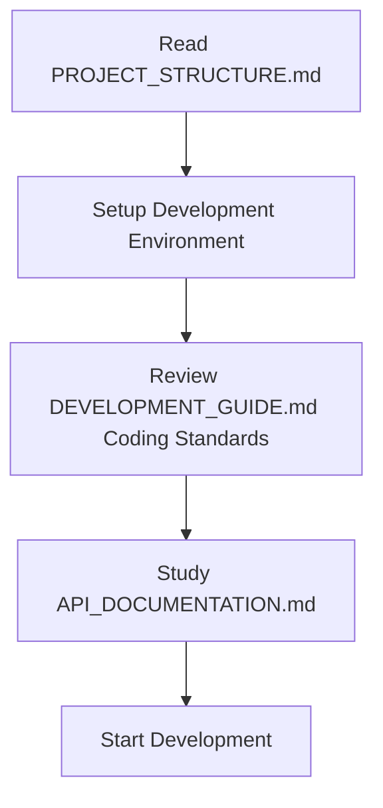
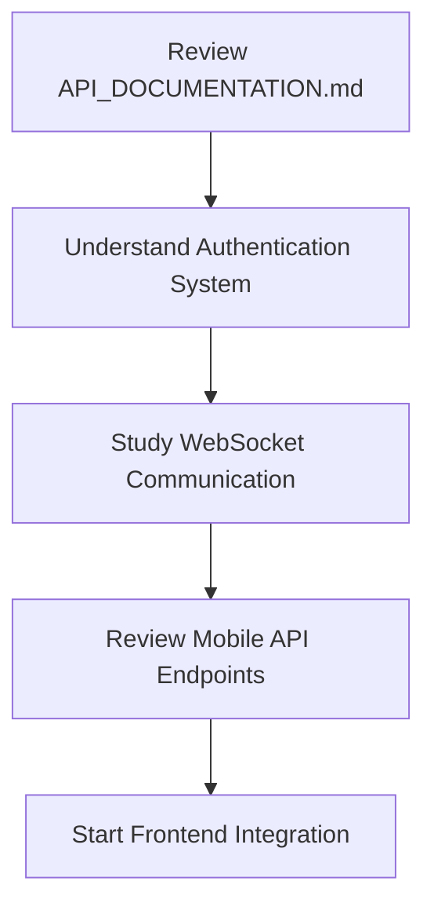
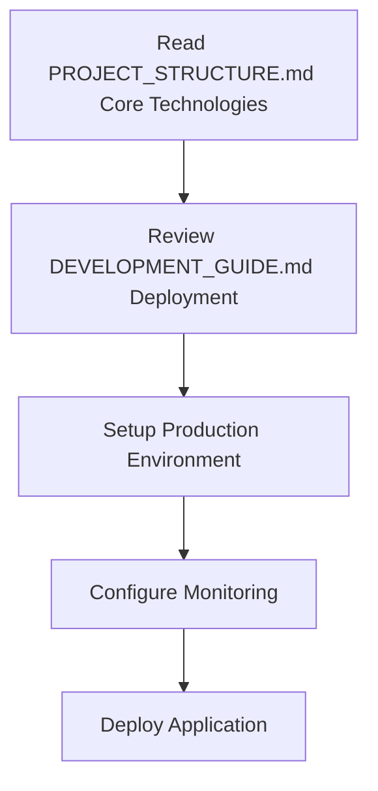

# CRM-CHAT Project Documentation Index

## 📚 Documentation Overview

欢迎使用 CRM-CHAT 项目文档中心。本文档集合提供了完整的项目结构分析、API接口说明和开发指南，帮助您快速了解和参与项目开发。

---

## 🗂️ Documentation Structure

### 📋 Core Documentation

#### 1. [PROJECT_STRUCTURE.md](./PROJECT_STRUCTURE.md)
**项目结构文档**
- 🏗️ 系统架构概览
- 📁 目录结构详解
- 🎯 核心组件分析
- 🔐 认证系统说明
- 💬 聊天系统架构
- 📊 数据库设计
- 🔧 第三方集成

#### 2. [API_DOCUMENTATION.md](./API_DOCUMENTATION.md)
**API接口文档**
- 🔐 认证系统 (JWT Token)
- 🏢 后台管理API (`/admin/*`)
- 👨‍💼 客服工作台API (`/kefu/*`)
- 📱 移动端API (`/mobile/*`)
- 🔗 WebSocket实时通信
- 📊 响应格式规范
- ⚠️ 错误代码说明

#### 3. [DEVELOPMENT_GUIDE.md](./DEVELOPMENT_GUIDE.md)
**开发指南**
- 🚀 快速开始
- 🏗️ 架构模式
- 📝 编码规范
- 🗃️ 数据库开发
- 🌐 API开发
- 🔄 队列任务开发
- 🔌 WebSocket开发
- 🧪 测试指南
- 📦 部署指南

---

## 🚀 Quick Navigation

### For New Developers
1. **Start Here**: [DEVELOPMENT_GUIDE.md#quick-start](./DEVELOPMENT_GUIDE.md#quick-start)
2. **Understand Architecture**: [PROJECT_STRUCTURE.md#system-architecture](./PROJECT_STRUCTURE.md#system-architecture)
3. **Learn API**: [API_DOCUMENTATION.md#api-overview](./API_DOCUMENTATION.md#api-overview)

### For System Administrators
1. **Deployment**: [DEVELOPMENT_GUIDE.md#deployment-guide](./DEVELOPMENT_GUIDE.md#deployment-guide)
2. **Configuration**: [PROJECT_STRUCTURE.md#configuration](./PROJECT_STRUCTURE.md#configuration)
3. **Monitoring**: [DEVELOPMENT_GUIDE.md#debugging--logging](./DEVELOPMENT_GUIDE.md#debugging--logging)

### For API Integration
1. **Authentication**: [API_DOCUMENTATION.md#authentication-system](./API_DOCUMENTATION.md#authentication-system)
2. **Admin API**: [API_DOCUMENTATION.md#admin-api](./API_DOCUMENTATION.md#admin-api)
3. **Mobile API**: [API_DOCUMENTATION.md#mobile-api](./API_DOCUMENTATION.md#mobile-api)
4. **WebSocket**: [API_DOCUMENTATION.md#websocket-api](./API_DOCUMENTATION.md#websocket-api)

---

## 📖 Documentation Features

### 🔍 Cross-References
所有文档都包含智能交叉引用，方便在相关内容间快速导航：
- **Internal Links**: 文档内部章节跳转
- **External Links**: 跨文档引用链接
- **Code References**: 具体文件和行号定位

### 📊 Interactive Elements
- **Code Examples**: 完整可执行的代码示例
- **API Testing**: 可直接使用的API请求示例
- **Configuration Templates**: 即用即取的配置模板

### 🔧 Practical Guidance
- **Step-by-step Instructions**: 详细的操作步骤
- **Troubleshooting Guides**: 常见问题解决方案
- **Best Practices**: 开发和部署最佳实践

---

## 🎯 Documentation Scope

### Architecture Coverage
- ✅ **System Architecture**: Complete system design overview
- ✅ **Directory Structure**: Detailed folder organization
- ✅ **Component Analysis**: Core component breakdown
- ✅ **Database Design**: Table structure and relationships
- ✅ **Integration Points**: Third-party service connections

### API Coverage
- ✅ **Authentication**: JWT token system
- ✅ **Admin Endpoints**: Backend management APIs
- ✅ **Service Endpoints**: Customer service APIs  
- ✅ **Mobile Endpoints**: Client application APIs
- ✅ **WebSocket Events**: Real-time communication
- ✅ **Error Handling**: Comprehensive error codes

### Development Coverage
- ✅ **Environment Setup**: Development environment configuration
- ✅ **Coding Standards**: PSR compliance and project conventions
- ✅ **Database Development**: Model, DAO, and migration patterns
- ✅ **API Development**: Controller and service layer patterns
- ✅ **Queue Development**: Background job processing
- ✅ **WebSocket Development**: Real-time feature implementation
- ✅ **Testing Guidelines**: Unit and integration testing
- ✅ **Deployment Procedures**: Production deployment steps

---

## 🚦 Getting Started Workflow

### For Backend Developers

### For Frontend Developers

### For DevOps Engineers

---

## 🔄 Documentation Maintenance

### Update Frequency
- **API Changes**: 实时更新
- **Architecture Changes**: 随版本更新
- **Development Guides**: 季度审查
- **Code Examples**: 持续验证

### Version Control
所有文档都进行版本控制，确保与代码库同步：
- **Git Integration**: 文档与代码同步提交
- **Change Tracking**: 详细的变更历史记录
- **Review Process**: 文档变更审查流程

### Quality Assurance
- **Technical Accuracy**: 代码示例可执行验证
- **Content Completeness**: 定期完整性检查
- **User Feedback**: 开发者反馈收集和处理

---

## 📞 Support & Feedback

### Getting Help
- **GitHub Issues**: 项目相关问题和建议
- **Documentation Issues**: 文档错误和改进建议
- **Development Questions**: 技术实现相关咨询

### Contributing to Documentation
欢迎为文档贡献：
- **Error Fixes**: 修正文档错误
- **Content Enhancement**: 补充缺失内容
- **Example Addition**: 添加实用示例

---

## 🏷️ Document Tags

### By Audience
- `#backend-developer` - 后端开发人员
- `#frontend-developer` - 前端开发人员
- `#system-administrator` - 系统管理员
- `#api-integrator` - API集成开发者
- `#devops-engineer` - 运维工程师

### By Topic
- `#architecture` - 系统架构
- `#api` - 接口文档
- `#database` - 数据库
- `#authentication` - 认证系统
- `#websocket` - 实时通信
- `#deployment` - 部署相关
- `#testing` - 测试相关

### By Priority
- `#essential` - 必读文档
- `#important` - 重要参考
- `#reference` - 参考资料

---

**Last Updated**: 2025-09-08  
**Documentation Version**: 1.0.0  
**Project Version**: CRM-CHAT v1.1

*Generated with CRM-CHAT Documentation Index System*